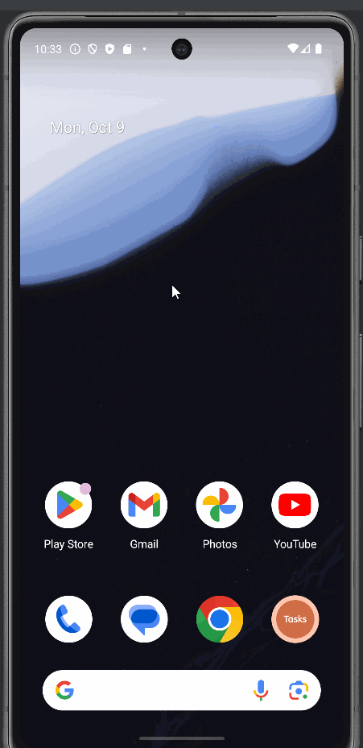

# Project 6: Notes App
An Android app that lets the user create and manage tasks.

## Functionality 

The following **required** functionality is completed:

* [ ] User can create new tasks
* [ ] User can set a name and description
* [ ] User can update already existing tasks
* [ ] User can delete tasks

The following **extensions** are implemented:

* I didn't implement any extensions for this project.

## Video Walkthrough

Here's a walkthrough of implemented user stories:

GIF created with [LiceCap](http://www.cockos.com/licecap/).

## Notes

I'm not sure why the dao was not updating properly in some scenarios, but I think the workarounds should have fixed the issues.

## License

    Copyright [2023] [Billy Moore]

    Licensed under the Apache License, Version 2.0 (the "License")
    you may not use this file except in compliance with the License.
    You may obtain a copy of the License at

        http://www.apache.org/licenses/LICENSE-2.0

    Unless required by applicable law or agreed to in writing, software
    distributed under the License is distributed on an "AS IS" BASIS,
    WITHOUT WARRANTIES OR CONDITIONS OF ANY KIND, either express or implied.
    See the License for the specific language governing permissions and
    limitations under the License.
