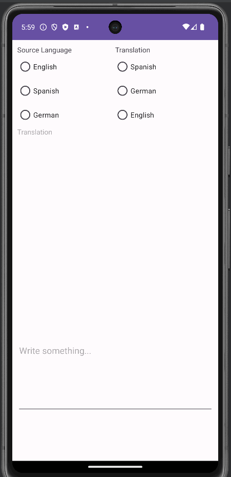

# Project 5: Translator App

An Android app that uses Google's MLKit library, for C323 Android Mobile Development.
It has three languages: German, Spanish, and English, and you can translate between any of them.

## Functionality 

The following **required** functionality is completed:

* [ ] User can pick a source language
* [ ] User can pick a target language
* [ ] User can enter text to be translated
* [ ] Translated text updates as soon as user types
* [ ] User can change languages

The following **extensions** are implemented:

* I didn't implement any extensions for this project.

## Video Walkthrough

Here's a walkthrough of implemented user stories:

GIF created with [LiceCap](http://www.cockos.com/licecap/).

## Notes

Using the Linear Layout took some time because I had gotten used to using Constraint Layouts for most projects.

## License

    Copyright [2023] [Billy Moore]

    Licensed under the Apache License, Version 2.0 (the "License")
    you may not use this file except in compliance with the License.
    You may obtain a copy of the License at

        http://www.apache.org/licenses/LICENSE-2.0

    Unless required by applicable law or agreed to in writing, software
    distributed under the License is distributed on an "AS IS" BASIS,
    WITHOUT WARRANTIES OR CONDITIONS OF ANY KIND, either express or implied.
    See the License for the specific language governing permissions and
    limitations under the License.
